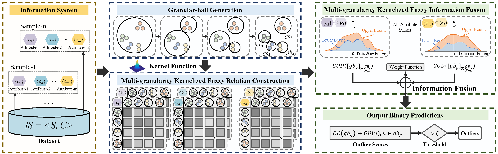

# KFGOD

Yongxiang Li, Xinyu Su, **Zhong Yuan***, Run Ye, Dezhong Peng, and Hongmei Chen, KFGOD: Kernelized Fuzzy Approximation Fusion with Granular-ball Computing for Outlier Detection
, Information Fusion, 2025.

## Abstract
Outlier detection is a fundamental task in data analytics, where fuzzy rough set-based methods have gained increasing attention for their ability to effectively model uncertainty associated with outliers in data. However, existing FRS-based methods often exhibit limitations when applied to complex scenarios. Most of these methods rely on single-granularity fusion, where all samples are processed at a uniform, fine-grained level. This restricts their ability to fuse multi-granularity information, limiting outlier discrimination and making them more susceptible to noise. Moreover, many traditional methods construct fuzzy relation matrices under linear assumptions, which fail to effectively represent the intricate, nonlinear relations commonly found in real-world data. This leads to suboptimal estimation of membership degrees and degrades the reliability of outlier detection. To address these challenges, we propose a Kernelized Fuzzy approximation fusion model with Granular-ball computing for Outlier Detection (KFGOD), which integrates multi-granularity granular-balls and kernelized fuzzy rough sets into a unified framework. KFGOD fuses multi-granularity information to capture abnormal information at different granularity levels. Simultaneously, kernel functions are employed to effectively model multi-granularity nonlinear relations, enhancing the expressive power of fuzzy relation construction. By performing information fusion across multiple kernelized fuzzy information granules associated with each granular-ball, KFGOD evaluates the outlier degrees of each ball and propagates this fused abnormality information to the corresponding samples. This hierarchical and kernelized method allows for effective outlier detection in unlabeled datasets. Extensive experiments conducted on twenty benchmark datasets confirm the effectiveness of KFGOD, which consistently outperforms several state-of-the-art baselines in terms of detection accuracy and robustness. The codes are publicly available online at https://github.com/LYXRhythm/KFGOD.

## Framework


## Directory Structure
```
.
├── code/                                 # Source code
│   └── GB_generation_with_idx.py         # Granular-ball generation
│   └── KFGOD.py                          # Main entry point
├── datasets/                             # Benchmark datasets used in the paper
└── README.md                             # Project readme
```

## Usage

### 1. Install dependencies
Ensure Python 3.8+ is installed. Required packages include:

- numpy  
- scikit-learn  

Install with:

```bash
pip install numpy scikit-learn
```

### 2. Run the code
```bash
cd code
python KFGOD.py
```

You can run KFGOD.py:
```python
if __name__ == "__main__":
    data = pd.read_csv("./annthyroid.csv").values
    X = data[:, :-1]
    n, m = X.shape
    labels = data[:, -1]
    ID = (X >= 1).all(axis=0) & (X.max(axis=0) != X.min(axis=0))
    scaler = MinMaxScaler()
    if any(ID):
        scaler = MinMaxScaler()
        X[:, ID] = scaler.fit_transform(X[:, ID])

    GBs = get_GB(X)
    n_gb = len(GBs)
    centers = np.zeros((n_gb, m))
    for idx, gb in enumerate(GBs):
        centers[idx] = np.mean(gb[:,:-1], axis=0)
        
    delta = 0.3
    outlier_degrees = KFGOD(centers, delta)
    print(outlier_degrees)
```
You can get outputs as follows:
```
粒球数量: 6
[1.16267042 1.15468636 1.15553024 1.15468636 1.15468636 1.16743584
 1.16267042 1.16743584 1.15553024 1.16267042 1.16267042 1.1478509
 1.15468636 1.15553024 1.16743584 1.16267042 1.16385854 1.16267042
 1.16385854 1.16267042]
```
## Citation
If you find KFGOD useful in your research, please consider citing:
```
@article{li2025kfgod,
  title={KFGOD: Kernelized Fuzzy Approximation Fusion with Granular-ball Computing for Outlier Detection},
  author={Li, Yongxiang and Su, Xinyu and Yuan, zhong and Ye, Run and Peng, Dezhong and Chen, Hongmei},
  journal={Information},
  year={2025},
}
```
## Contact
If you have any questions, please contact rhythmli.scu@gmail.com or yuanzhong@scu.edu.cn.
